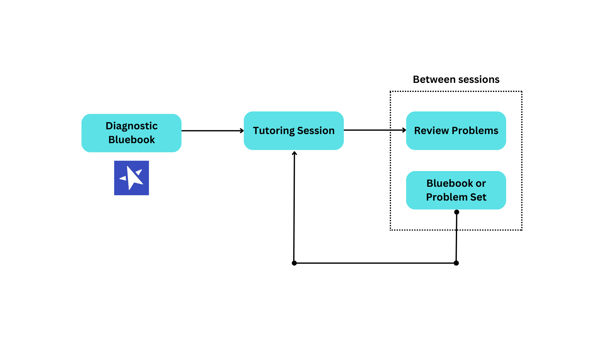

My tutoring strategy is backed by cognitive science and continuous data and feedback from my students. Here is what works:

<h3>Practice Tests</h3>
The best way to prepare for the SAT is to take the SAT.

In general, tests don't only serve as tools for assessment, but also as tools for *learning*. <a href="https://www.ncbi.nlm.nih.gov/pmc/articles/PMC6920642/#:~:text=Testing%20or%20retrieval,eg%2C%20marginal%20knowledge)." target="_blank">Studies</a> consistently find testing to be the best form of studying for long-term retention, since it demands greater attention and helps identify gaps in knowledge. 

But why *official* practice tests? <a href="https://www.tandfonline.com/doi/abs/10.1080/09658211.2014.970196#:~:text=When%20the%20review,performed%20during%20restudy." target="_blank">Studies</a> have also proven the importance of **transfer-appropriate processing**, which states that you should study in the same way that you'll be tested. By taking CollegeBoard's official practice tests, you subconsciously pick up on syntax that allows you to recognize patterns.

Official resources include the 6 <a href="https://bluebook.collegeboard.org/students" target="_blank">Bluebook</a> practice tests, 6 <a href="https://satsuite.collegeboard.org/sat/practice-preparation/practice-tests/linear" target="_blank">Linear</a> practice tests, and 10 problem sets (34Q each) that I've compiled which contain every difficult problem from the SAT question bank.

But the answer explanations for these practice tests are often insufficient. First, they **never** suggest the use of DESMOS, which could save you time on around **20-40%** of SAT problems. Second, answer explanations show you the right way to **solve** problems, but not the right way to **think** about them. That's where my tutoring comes in.

<h3>Talking Through Your Work</h3>

In a tutoring session, we go through every problem the student missed on their last practice test. I start off by asking the student **how they approached the problem**. 

If they weren't even sure where to begin, we begin by defining terms. I may ask "when are exponential functions used?" or "what makes triangles similar?" to encourage students to think conceptually about the problem rather than procedurally.

If the student did attempt the problem, we walk through their work until we reach the step that led them to the wrong answer. Our focus is not on how to *solve* the problem correctly, but rather how to *think* about the problem correctly. It's a **conversation**, not a lecture.

<h3>Concepts First</h3>
Especially on the DSAT, problems are becoming increasingly conceptual, so the focus of my tutoring is always on building **understanding**, not memorization.

And even when memorization is necessary, the best way to memorize formulas is to understand **where** they come from. For example, students often forget the distance formula and the circle formula, but these formulas are easy to remember if you learn that they're just subtle rewritings of the pythagorean theorem!

I approach concepts from multiple angles. We may look at a concept algebraically, graphically, and in applications, until it finally clicks. The goal is that the student understands a concept well enough to **teach it themselves**.

<h3>Spaced Repetition</h3>

According to Ebbinghaus’ Forgetting Curve and <a href="https://www.ncbi.nlm.nih.gov/pmc/articles/PMC4492928/" target="_blank">modern replications</a>, people forget around **70%** of learned material after a week.

To mitigate this, my students review each session's problems at least 5 days after the session, using <a href="../images/pdfs/reviewing-problems.pdf" target="_blank">this</a> framework.

Essentially, students must solve each problem start to finish on their own, and then explain verbally why their solution works.

<h3>Optimization</h3>
Often times, there are many ways to solve an SAT problem, but only one optimal approach. An optimal approach is not necessarily the fastest, but rather the most **accurate** for the time allotted. For graphing problems, this usually involves DESMOS.

I also prescribe bigger picture test-taking strategies to experiment with while taking practice tests. Changing up time constraints, pacing, environment, or just mentality, can give unexpected insights about how to test better.

<b>To see this strategy in action, book a session below!</b>



