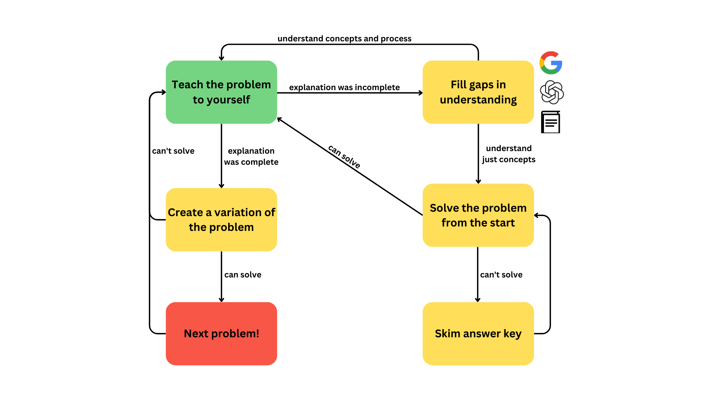

<h2>1. Representative Problems</h2>
The best way to prepare for the SAT is to take the SAT.

In general, tests don't only serve as tools for assessment, but also as tools for *learning*. <a href="https://www.ncbi.nlm.nih.gov/pmc/articles/PMC6920642/#:~:text=Testing%20or%20retrieval,eg%2C%20marginal%20knowledge)." target="_blank">Studies</a> consistently find testing to be the best form of studying for long-term retention, since it demands greater attention than textbooks, articles, or videos (even my own).

But not all practice problems are created equal. <a href="https://www.tandfonline.com/doi/abs/10.1080/09658211.2014.970196#:~:text=When%20the%20review,performed%20during%20restudy." target="_blank">Studies</a> have also proven the importance of **transfer-appropriate processing**, which states that you should study in the same way that you'll be tested. Therefore, you want to solve problems that are either written by College Board, or are very closely related to official problems.

<h2>2. Finding the Optimal Difficulty</h2>
Most representative problems are still not very helpful! They're either too easy or too hard. 

If a problem is too easy, you're not learning anything new. You're just regurgitating the same processes you already know. 

If a problem is too hard, you'll waste time and energy that could have been spent on more requisite content. There's a reason we don't teach fifth-graders calculus.

The optimal problem is one that is **easy enough to start but too hard to finish**. You understand the key concepts, you have some ideas for how to get the answer, but there's *something* preventing you from getting there. That *something* is what you **learn** by tackling the problem.

PrepPros' book makes it easy to find the "optimal" problem by categorizing every problem into one of 4 levels of difficulty. Students focus exclusively on problems within their level.

<h2>3. Breadth Over Depth</h2>
Many students, when using a prep book, start on page 1 question 1 and move chronologically through every page and every problem. This is what I would call a **depth-first** approach and it is *NOT* efficient.

The SAT diversifies its questions, so "chapter 1" in a prep book might only correspond to 1 or 2 questions on the actual SAT. Think of studying the chapter as increasing the likelihood that you get those 1-2 questions correct.

In your first hour of studying, your odds go from 50% to 70%. Then in your second hour, 70% to 85%. Third hour: 85% to 90%. Fourth hour: 90% to 93%. 

Notice that there are diminishing returns. The more you study a topic, the *less* you improve your score per hour of studying.

So, my tutoring applies a **breadth-first** approach to prep. We try to cover as **much** ground as **quickly** as possible. Then, after our initial breadth-first overview, we return to the student's weakest areas and "level up" the problem difficulty across the board. 

[//]: # ()

<h2>4. Talking Through Your Work</h2>

During each tutoring session, we cover the problems that students struggled with on their own time. For each problem, I begin by asking **"How did you approach this problem?"**

If the student is missing the big picture, we begin by defining terms. I may ask "when are exponential functions used?" or "what makes triangles similar?".

Our focus is not on memorizing a procedure, but on developing **mathematical intuition.** Thinking conceptually from **first principles** is the key to solving the most challenging SAT problems and becoming a stronger math student overall.

In order to accomplish this, we may look at a concept algebraically, graphically, and in applications, until it finally clicks. The goal is that the student understands each concept well enough to **teach it themselves.**

<h2 id="repetition">5. Spaced Repetition</h2>

According to Ebbinghaus’ Forgetting Curve and <a href="https://www.ncbi.nlm.nih.gov/pmc/articles/PMC4492928/" target="_blank">modern replications</a>, people forget around **70%** of learned material after a week.

To mitigate this, students should review each session's problems a few days after the session, using the framework below.

A key part of this framework is creating **variations** of problems. This encourages **lateral thinking**, as students must think creatively about unfamiliar ways that CollegeBoard might test familiar concepts.

<b>To see this strategy in action, book a session below!</b>



